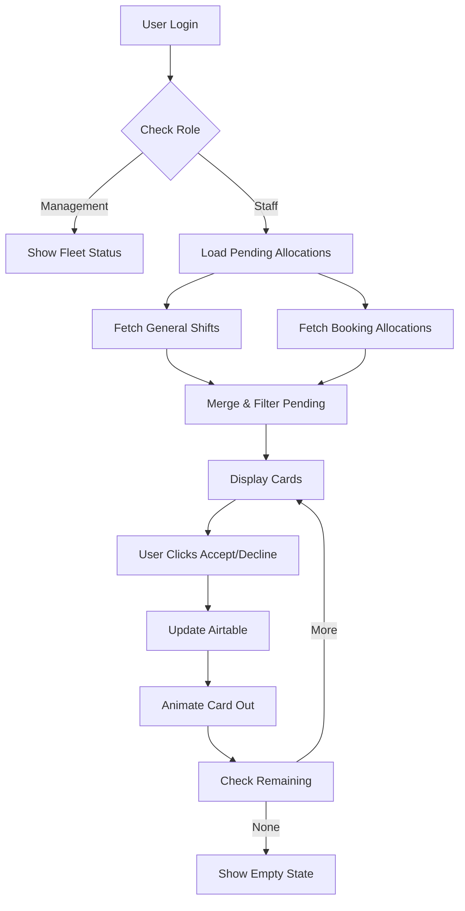

# Dashboard Features - Quick Implementation Reference

## 🎯 Features Implemented Today

### 1. Role-Based Dynamic Content Card
**Location**: Third info card on dashboard (`dashboard.html`)

#### For Management Staff
- Shows: **Fleet Status**
- Content: Vessel operational status
- Link: To vessel information page

#### For Non-Management Staff  
- Shows: **Pending Shift Responses**
- Content: List of pending allocations requiring response
- Actions: Quick Accept/Decline buttons
- Link: To full schedule view

### 2. Data Architecture

```javascript
// Management Detection Logic
const managementEmails = [
    'harry@priceoffice.com.au',
    'mmckelvey03@gmail.com', 
    'manager@mbh.com',
    'admin@mbh.com',
    'operations@mbh.com'
];

// Also checks for @mbh.com domain
if (managementEmails.includes(user.email.toLowerCase()) || 
    user.email.includes('@mbh.com')) {
    isManagement = true;
}
```

### 3. Dual Data Source Pattern

The system fetches pending allocations from TWO sources:

```javascript
// Source 1: Shift Allocations Table (General Shifts)
async function loadGeneralAllocations() {
    // Table: tbl22YKtQXZtDFtEX
    // Filter: Employee linked record includes current employee
    // Check: Response Status = 'Pending' or null
}

// Source 2: Bookings Dashboard (Customer Bookings)  
async function loadBookingAllocations() {
    // Table: tblRe0cDmK3bG2kPf
    // Check: Onboarding Employee or Deloading Employee
    // Status: Onboarding/Deloading Response = 'Pending'
}
```

### 4. Response Processing

#### General Allocations Update
```javascript
// Updates Shift Allocations table
PATCH /v0/applkAFOn2qxtu7tx/tbl22YKtQXZtDFtEX/{allocationId}
{
    'Response Status': 'Accepted/Declined',
    'Response Date': timestamp,
    'Response Method': 'Portal'
}
```

#### Booking Allocations Update
```javascript
// Updates Bookings Dashboard table
PATCH /v0/applkAFOn2qxtu7tx/tblRe0cDmK3bG2kPf/{bookingId}
{
    'Onboarding Response': 'Accepted/Declined', // OR
    'Deloading Response': 'Accepted/Declined'
}
```

### 5. Visual Design System

#### Status Colors
- **Pending**: Yellow/Orange (`#f39c12` border, `#fff9e6` background)
- **Accepted**: Green (`#27ae60` button/border, `#e8f5e9` background)
- **Declined**: Red (`#e74c3c` button/border, `#ffebee` background)

#### Card Types
- **General Shift**: Blue accent border
- **Booking Allocation**: Orange accent border (`#ff9800`)

#### Animations
- **Hover**: `translateX(5px)` shift right
- **Accept/Decline**: `translateX(100%)` slide out + fade
- **Loading**: Rotating spinner

### 6. User Flow



### 7. Key Functions in dashboard.html

```javascript
// Main Functions
loadDynamicCard()           // Determines content based on role
loadPendingAllocations()     // Fetches all pending items
loadGeneralAllocations()     // Gets shift allocations
loadBookingAllocations()     // Gets booking allocations  
displayPendingAllocations()  // Renders the cards
handleAllocationResponse()   // Processes accept/decline
formatDate()                 // Formats dates for display
```

### 8. Testing Scenarios

#### As Non-Management (harry@kursol.io)
1. Dashboard shows "Pending Shift Responses"
2. Lists any pending allocations
3. Accept/Decline buttons work
4. Cards animate out after response
5. Shows "No pending" when empty

#### As Management (harry@priceoffice.com.au)
1. Dashboard shows "Fleet Status"
2. No pending allocations visible
3. Management button in toolbar

### 9. Common Issues & Fixes

| Issue | Cause | Solution |
|-------|-------|----------|
| No pending shown | Employee record not found | Check email match in Airtable |
| Accept fails | Missing response fields | Ensure Onboarding/Deloading Response fields exist |
| Wrong card shows | Email not in management list | Add email to managementEmails array |
| Duplicates appear | Not removing after response | Ensure card removal animation completes |

### 10. Performance Notes

- Fetches ALL records then filters (no pagination)
- Two API calls in parallel (Promise.all)
- Client-side filtering for pending status
- Manual refresh required (no real-time)

### 11. Security Considerations

⚠️ **API Key Exposed**: Airtable key visible in client
⚠️ **No Server Validation**: Direct browser to Airtable
⚠️ **Rate Limiting**: 5 req/sec shared by all users

### 12. Files Modified

```
/training/dashboard.html
├── CSS: Lines 232-364 (Pending allocation styles)
├── HTML: Line 482 (Dynamic card container)
├── JS: Lines 623-949 (All implementation logic)
└── Variables: Lines 512-514 (Added tracking variables)
```

### 13. Deployment

```bash
# Changes deployed via:
git add -A
git commit -m "feat: Replace Fleet Status with Pending Allocations for non-management staff"
git push origin main
# Railway auto-deploys to production
```

## Quick Debug in Browser Console

```javascript
// Check user role
console.log('Is Management:', isManagement);
console.log('Employee ID:', employeeRecordId);

// Force reload pending allocations
await loadPendingAllocations();

// Check data sources
console.log('General:', await loadGeneralAllocations());
console.log('Bookings:', await loadBookingAllocations());

// Manually trigger response
handleAllocationResponse('test-id', 'accept');
```

## Success Metrics

✅ Feature successfully implemented and verified
✅ User confirmed immediate functionality
✅ Both accept and decline actions working
✅ Visual feedback and animations smooth
✅ Correct role-based content display

---
*Implementation Date: January 2025*
*Verified Working: Yes*
*Production URL: https://mbh-production-f0d1.up.railway.app*
